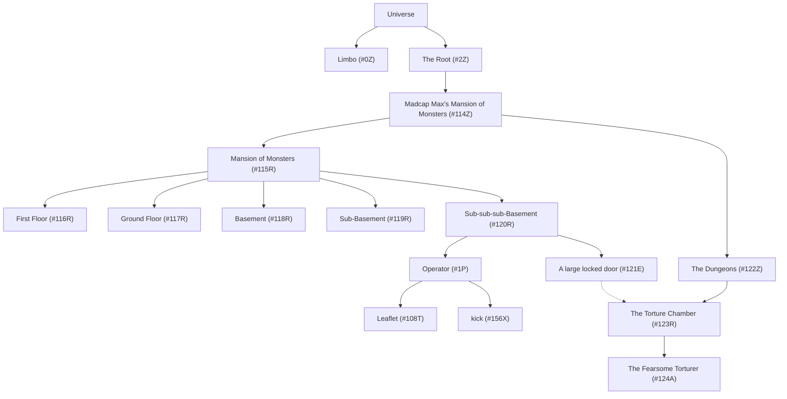
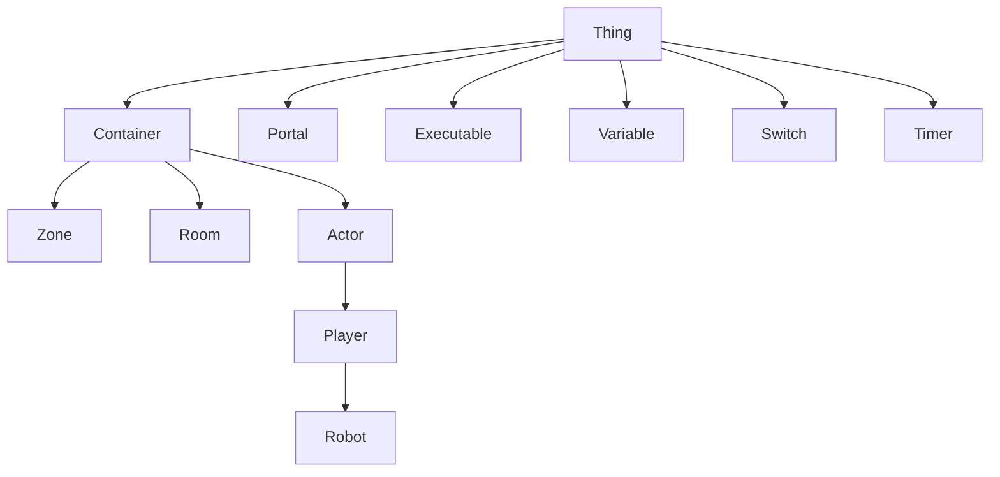

# West of House

Back in 1975, a programmer started putting together the first of a brand new
genre of computer game: [the text adventure](https://wikipedia.org/wiki/Colossal_Cave_Adventure).

A little while later, and some nerds at MIT created what was to become the
most successful and iconic example of the genre, and it was called `DUNGEON`,
right up until the point that MIT got threatened with legal action over the
name, and so (the story goes), even though MIT's lawyers were pretty confident
about their chances, they decided to give it a new name, and so it began…

```
West of House
This is an open field west of a white house, with a boarded front door.
There is a small mailbox here.
A rubber mat saying 'Welcome to Zork!' lies by the door.`
```

Zork had a dungeon! a dragon! a wizard! a thief! treasure! labyrinths!
puzzles! (but it was not an RPG)

But _this_ project is not especially about Zork, nor Infocom—the company
those MIT nerds founded to sell a chaptersied version of their game that
would fit on the tiny (compared to MIT's mainframe) home computers of the
day. There are lots of open source projects out there that re-create the
[Z-Machine](https://wikipedia.org/wiki/Z-machine) that powered the Zork
adventures. This is not one of them.

By 1978, a student at the University of Essex decided to try creating a
new (or old, if you consider table-top RPGs to be at least some of the
inspiration for many of these games) spin on the idea: _multi-player_
dungeon. But that isn't a good acronym and so instead the [MUD](https://en.wikipedia.org/wiki/Multi-user_dungeon),
or Multi-User Dungeon—was born.

As universities were connected to one another, lots of other people over the
years had the idea of running their own MUD, and there have been both lots
of MUD servers, but also lots of different MUD platforms (_codebases_), and
also quite a bit of people sharing the the worlds that they've designed with
one another so that you can play them on _your_ server with your friends.

Generally, MUDs stored the information about the world you and your friends
(and/or enemies) were roaming around—all the locations, the NPCs, the treasures,
and puzzles, and hazards, in a bunch of files on disk in one of an assortment
of poorly-documented but serviceable file formats.

It's important to remember that a lot of MUDs were still being run primarily
out of student accounts on university servers, and so space was at an absolute
premium.

But over time, computers got bigger and faster and felt a little bit roomier,
and by the time the 1990s came along, some branches of the MUD family tree
were going big on flexibility: the more you could do without having to edit
the codebase itself the better, and the holy grail was always to be able to
build an entire world, and define everything about how it functions and players
interact with it "online"—that is, you connect to the server as a player with
sufficient privileges, and you have extra commands available that let you build
what you want. No more messing around with files on disk and having to force
your server to reload them; no more recompiling codebases to get new and
interesting NPC behaviours.

Codebases such as [TinyMUX](https://www.tinymux.org) implemented precisely this
idea, and I—at the time—really liked a great deal about what they were trying
to do, but I could never _quite_ get comfortable with how any of them worked:
either I was so distracted by features missing that I wanted that I'd get lost
in writing code instead of world-building, or I'd really struggle to get to
grips with the world-building commands themselves: bootstrapping was often
quite hard, and naturally a lot of the libraries of "softcode", as it's known
(in contrast to "hardcode", which is compiled-in) would end up being quite
opinionated about how things worked.

And naturally I wanted to build my own from scratch in 1996 or so but none
of my attempts ever made substantial progress, not least because I definitely
wasn't good enough at software architecture to have been able to pull it off:
these things are complex.

But it's now 2023, and although I don't necessarily want to run a MUD, I have
yet to scratch that itch of this _kind_ of world-building environment that
works the way I wanted it to (which is, all credit where it's due, absolutely
inspired by and influenced by TinyMUX: I spent a lot of time building things
on a TinyMUX-based [talker](https://en.wikipedia.org/wiki/Talker) which had
enjoyed a huge amount of collective effort to create what was there and that
I could learn from).

And so this codebase is the beginning of that, put together very simply
because time has moved on and whilst reading JSON files from disk on-demand
would have been pretty unthinkable approximation of a workable "database"
in the mid-1990s, but for a single user doing that on a laptop with modern
kernel caches and SSDs, it's faster than anything but an in-memory database
would have been back then (and probably much faster than that). Also, I don't
need to parse JSON myself. Or invent it.

_Side-note:_ In any event, all of the objects in this implementation are
reference-counted once loaded and provided they lie within a specific
designated "root" object which is pre-loaded at startup, they'll be cached in
memory anyway.

# What is it, and how does it work?

Okay, TL;DR version: there's a hierarchical tree of objects which can be of
several different kinds ranging from fairly self-explanatory ones such as
"room" and "player" to somewhat more interesting things like "executable"
and "timer". There are a set of built-in commands, known as _at-commands_,
because they all begin with a `@` sign. Using these commands, you can create,
modify, and destroy these different kinds of objects.

Make sense? Cool. Here comes the science…

Once you have created a database with the `nexus-createdb` command (which
simply creates a directory and puts some initial JSON files in it), you
can launch `nexus-builder`. This is essentially "god mode": apart from certain
system objects, you can do anything (to the extent that the commands have
been implemented).

`nexus-builder`, as you'll see from the code, is actually pretty trivial,
but all it needs to do is construct a `Universe` and find the `Player`
representing you—which is called `Operator`—and ask it to perform the
commands that you type in. Once there's sufficient world-building capability
implemented that there's something worth _playing_, the plan is to add a
`nexus-player` tool that also operates on the same database, but creates (or
locates) a _different_ `Player` which doesn't, at least not by default,
have the privileges to do the same kind of world-building.

(This could of course just be the same binary inspecting `argv[0]` or having
an "Operator mode" command-line option)

One would be forgiven for envisaging this and wondering how hard it would be
to _make_ it multi-user at this point? Well, comparatively, probably not
very, unless you decided to introduce multithreading or something (don't). We'll
cross that bridge if and when we arrive at it.

# Dependencies, building, etc.

For reasons may become clearer later, this is partly built using a library
called Flux that I am putting together in the aid of implementing something
else entirely, but for _now_ the only actual use is that all objects are
subclasses of `WARP::Flux::Object`, which provides a simple (not thread-safe)
reference-counted object via explicit `retain()` and `release()` calls (and
`protected` virtual destructors and no use of `delete` except in the base's
own `release()` method). Obviously this code could be trivially expropriated
if it becomes expedient to drop the dependency, although I would prefer not
to. It's included as a submodule to ease that, so ensure after cloning you

```sh
git submodule update --init --recursive
```

Until I autotoolsify this project, you'll need to manually run:

```sh
( cd WARP && autoreconf -fvi && ./configure && make )
```

You can then

```sh
make
./nexus-createdb db
./nexus-builder db
```

There's also a `Dockerfile` with some interesting targets that will do some
of this for you. The snag is that `nexus-createdb` requires the directory
it creates does not already exist, which means you have to mount the _parent_
directory into the container. `nexus-createdb` should really just have a
command-line switch to force it to use an existing (empty) directory.

If you manage to get it up and running, `@commands` lists available commands.

At the time of writing, the parser doesn't know about quoted arguments or
escaping so you can only set something's description to a single world. This
is suboptimal.

(You can, however, always edit the `.json` and `.desc` files—don't do that
with the builder running, or else it will overwrite your changes—it doesn't
yet detect that files on disk have changed and managing that might be
quite tricky with the current implementation)

# Bugs and to-do

Vast numbers of both. This is pre-alpha.

# Reference

## Database

As alluded to above, the `Database` is an encapsulation of a directory tree
of JSON files into an extremely simple "NoSQL"-like database that uses
incrementing integer numeric keys.

The `Database` uses a simple file structure where the object with the ID `#1`
is written to `db/1/1.json` and the object with the ID `#123456` is written to
`db/123456/123456.json`.

The `Database` has a couple of extra behaviours, however:

* There's a `db/db.json` object which stores metadata. Currently, it contains information about the schema version, timestamps, identifier allocations, and the `Universe` configuration (below).
* The lowest-numbered object identifiers are reserved for system use (this is technically configurable within the Database metadata).
* If the object has properties named `description` or `text`, then these are written to separate files and not stored in the JSON object.
* If the object is of type `Zone` or `Player` (see below), a simple index (consisting of an object with canonicalised names as keys and numeric object IDs as values) is maintained so they can be resolved by name

## Universe

The `Universe` is the manifestation of the JSON objects in a `Database`, and
is really just a thin wrapper for lifecycle management and
abstraction-cleanliness purposes.

In particular, the `Universe` ensures that objects `#0` (`Limbo`),
`#1` (`Operator`) and `#2` (the "root" `Zone`), all described in more detail
below, exist and are cached in memory.

A `Universe` has a _name_ and will over time have other configuration
properties, which are stored within the `Database`'s metadata object.

Here's an abbreviated example of how a Universe might be arranged:—



More about the different types of objects is given below, but in the above
you can see:

* Zones (Limbo, The Root, Madcap Max's Mansion of Monsters, The Dungeons)
* Locations (Mansion of Monsters, First Floor, Sub-sub-sub-Basement), etc.)
* a non-player Actor (The Fearsome Torturer)
* a Portal ("A large locked door"), which has a _target_ ("The Torture Chamber")
* a Thing ("Leaflet")
* an Executable — i.e., a command ("kick")
* a Player ("Operator" — that is, you)

## Objects

Every object in the universe has a numeric ID, which is written in the
form `#nnn`, or optionally `#nnnX`, where `X` is the type of object.

IDs below `#100` are reserved for internal use. Some well-known IDs:

* `#0Z` is the special `Zone`, `Limbo`
* `#1P` is the built-in `Player` with full privileges, `Operator`
* `#2Z` is the "root" `Zone`

Others may be added later.

When using built-in commands that operate on objects, you can always specify
an object by its ID (e.g., `#104`), regardless of where in your universe that
object actually is.

Objects are polymorphic:



### Thing (`T`)

`Thing`s are the base class for all in-universe objects: that is, everything
is technically a `Thing`, but objects can be _just_ `Thing`s. These are used
for simple objects that don't really need to do much, such as decorative
items.

### Container (`C`)

`Container`s are another family of objects, all having the specific property
that they can (predictably) contain other objects. A generic `Container` can
hold any number of any type of object. Because this also includes the "hidden"
objects that will be described below, `Container`s are important for enabling
interactivity.

### Zone (`Z`)

`Zone`s are a way of partitioning your universe, with potentially different
sets of rules, behaviours, and even commands. All objects (including `Players`)
have a `Zone`, which is always the nearest parent container which is a `Zone`
object. As a fallback, there is a special built-in `Zone` called `Limbo` which
always has the object ID `#0`.

When a universe is first bootstrapped, a "root" `Zone` object is created with
the ID `#2`, and all zones that you create will ordinarily exist somewhere
within that. This root `Zone` (and its entire contents) is loaded automatically
when the universe starts up. 

Moving (via `@teleport`) an object to `Limbo` has the effect then of removing
it from the set of objects which will be kept in memory at all times: although
they will remain in memory for as long as `Limbo` itself does, if you re-start
the builder, you'll see that those objects aren't in `Limbo` any more, and in
fact they don't appear to be _anywhere_. However, you can `@examine` them by
specifying their IDs—which will cause them to be loaded from disk, their
information displayed, and then discarded again. And of course you can
`@teleport` them _back_ "into existence", even if you teleport them back to
`Limbo` itself (although that will only persist until the builder is restarted).

Internally, the `@destroy` command marks objects as destroyed and then moves
them to `Limbo`. At some point, there will probably be both commands to discard
objects from `Limbo` immediately (perhaps `@discard`), and to purge destroyed
objects (or possibly move them to  "deleted" directory within the database
tree).

Besides the root object tree, the primary use for `Zones` is as a command
evaluation scope. Commands (`Executable`s) placed directly within a `Zone`
are available everywhere within that `Zone`, at any level in the hierarchy.

## Room (`R`)

A `Room` represents a location: it has a title, a description, is type of
`Container` so can contain scenery and `Players` and `Thing`s and, importantly,
`Portal`s to other `Room`s.

Although they're called `Room`s they are used for both indoor and outdoor
notional locations, there is no technical difference besides how you describe
them. You might wish to _introduce_ a distinction in your universe: perhaps
you have weather events happen which don't impact indoor locations, but that
ought to be achieveable via custom properties.

## Portal

A `Portal` is an object which has a _destination_, and `@teleporting` to a
`Portal` transports you to that destination. A lot like a symbolic link or
a hyperlink, depending upon your point of view.

`Portal`s are therefore used to implement exits, which you can opt to name
directionally, or more descriptively, or both.

## Actor

An `Actor` is an autonomous character.

## Player

A `Player` is a subclass of `Actor` which is primarily used to distinguish
player from non-player characters.

## Robot

A `Robot` is a type of `Player` which is actually operated by some _other_
software. How exactly a `Robot` is controlled is entirely TBD.

## Executable

## Switch

## Timer
